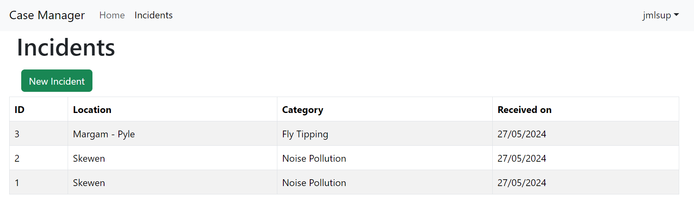
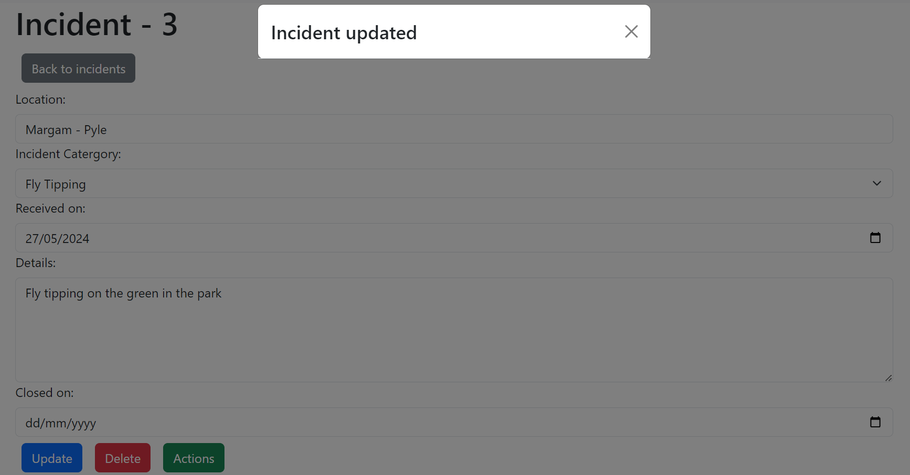
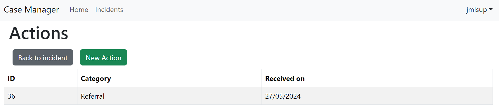
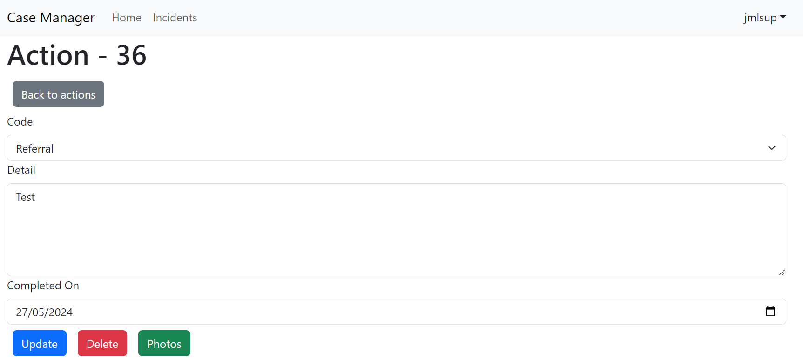
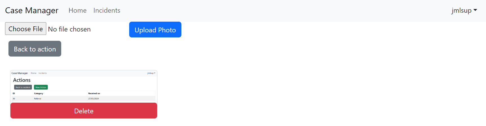

# Project 5 Case Manager

## Table of content
1) [About](#about)
2) [Project](#project)
3) [Technologies used](#technologies-used)
4) [Features](#features)
5) [UX Design](#ux-design)
6) [Testing](#testing)
7) [Deployment](#deployment)
8) [Credits](#credits)

## About
This Case Manager web application allows users to create incidents relating to UK Public Protection governed by the Local Authorities. 

Users will then be able to create 'actions' which will record what the user has done for each incident and then be able to attach any relevant photos related to that action.

## Project
### Scope of Work for Fly-Tipping Incident Tracking Application

#### 1. Overview
The purpose of this project is to develop a web application that allows users to track and manage Public Protection incidents. The application will provide features for creating incidents, recording actions taken, and attaching relevant photos.

#### 2. Objectives
- Provide a user-friendly interface for creating and managing fly-tipping incidents.
- Enable users to record actions taken for each incident.
- Allow users to attach photos related to each action.
- Implement a robust backend for storing and retrieving incident data.

#### 3. Features/User Stories
- User Authentication: Register and log in to the application.
- Incident Creation: Create a new incident with details such as location, category, and date.
- Action Recording: Record actions taken for each incident.
- Photo Attachment: Attach photos related to each action.
- Incident Management: Update and delete incidents.

#### 4. Technologies
- Frontend: React.js with Vite for building the user interface.
- Backend: Django Rest Framework for the server, postgres for the database.
- Authentication: JWT for user authentication.
- Cloud Storage: Cloudinary for storing photos.

#### 5. Deliverables
- Fully functional web application deployed on Heroku.
- Comprehensive documentation including setup instructions, user guide, and developer guide.

#### 6. Timeline
The project will be completed in phases, with each phase focusing on a specific set of features. The estimated timeline is as follows:
- Phase 1 (User Authentication)
- Phase 2 
- Phase 3 
- Phase 4 
- Phase 5 

## Technologies used

### Main
- React.js
- JavaScript
- HTML
- CSS
- Vite

### Libraries
- React Bootstrap
- jwt-decode
- serve
- axios

## Features

### NavBar

The NavBar is on all pages, helping the user navigate the website easily, as well as indicating the logged in user on the top right.

### Incidents List

The incidents page shows all of the incidents the user has entered and users can click the relevant row to take them to that incident alternatively they can click the 'New Incident' button to create a new incident.

### Incident

This is the incident details page which displays the incident from here you can update delete or take you to the actions page where you can add actions to the incident.

### Actions List

This is the actions page which displays all of the actions linked to the incident previous. Keeping to the same experience as the incidents list users can click the relevant row for the action which will take them to the detail of that action or they can click the 'New Action' button to add a new action

### Action

This is the action detail page where users can create delete and update actions. When updating creating or deleting an action it will take you back to the actions list page as users are more likely to add a new action again or review the actions than add photos. Clicking back into the action will let users select the 'Photos' button to look and add new photos

### Action Photos

This is the action photos page which lets users view add and delete photos to the linked action

## UX Design

## Testing

## Deployment

## Credits
