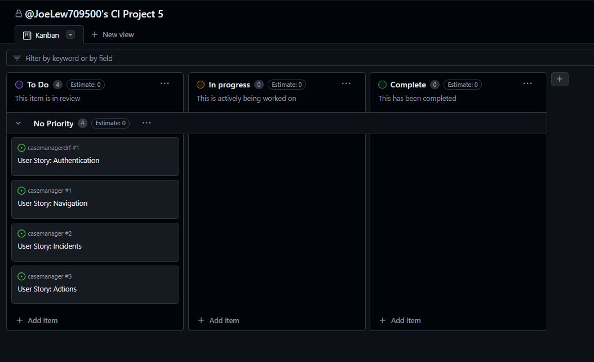
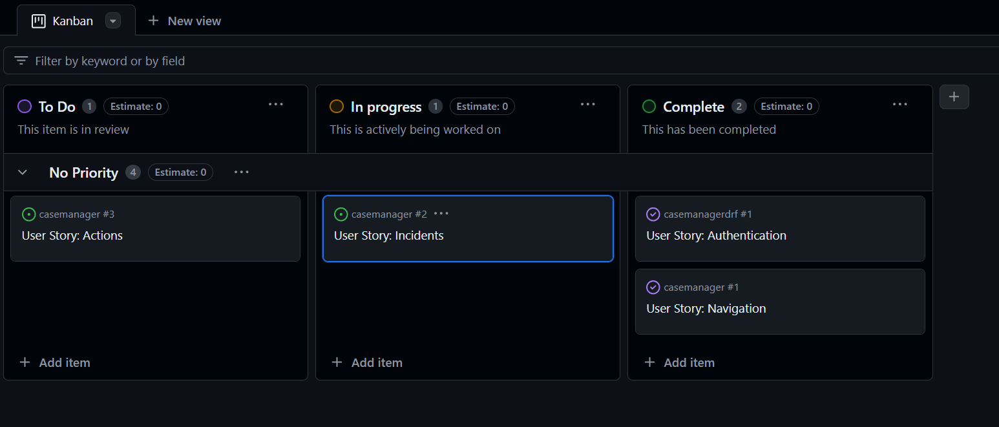
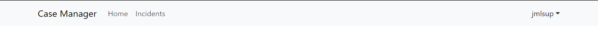

# Project 5 Case Manager

[Link to live site hosted by heroku](https://project-5-react-ci-214ec78c6a84.herokuapp.com/)

## Table of content
1) [About](#about)
2) [Project](#project)
3) [Technologies used](#technologies-used)
4) [Features and UX Design](#features--ux-design)
6) [Testing](#testing)
7) [Deployment](#deployment)
8) [Credits](#credits)

## About
This Case Manager web application allows users to create incidents relating to UK Public Protection governed by the Local Authorities. 

Users will then be able to create 'actions' which will record what the user has done for each incident and then be able to attach any relevant photos related to that action.

## Project
### Scope of Work for Incident Tracking Application

#### 1. Overview
The purpose of this project is to develop a web application that allows users to track and manage Public Protection incidents. The application will provide features for creating incidents, recording actions taken, and attaching relevant photos.

#### 2. Objectives
- Provide a user-friendly interface for creating and managing incidents.
- Enable users to record actions taken for each incident.
- Allow users to attach photos related to each action.
- Implement a robust backend for storing and retrieving incident data.

#### 3. Features/User Stories
- User Authentication: Register and log in to the application.
- Incident Creation: Create a new incident with details such as location, category, and date.
- Action Recording: Record actions taken for each incident.
- Photo Attachment: Attach photos related to each action.
- Incident Management: Update and delete incidents.

#### 4. Technologies
- Frontend: React.js with Vite for building the user interface.
- Backend: Django Rest Framework for the server, postgres for the database.
- Authentication: JWT for user authentication.
- Cloud Storage: Cloudinary for storing photos.

#### 5. Deliverables
- Fully functional web application deployed on Heroku.
- Comprehensive documentation including setup instructions, user guide, and developer guide.

#### 6. Timeline and User Stories
The project will be completed in phases, with each phase focusing on a specific set of features. The estimated timeline is as follows:
- [Phase 1 (User Authentication)](https://github.com/JoeLew709500/casemanagerdrf/issues/1)

- [Phase 2 (Navigation)](https://github.com/JoeLew709500/casemanager/issues/1)

- [Phase 3 (Incidents)](https://github.com/JoeLew709500/casemanager/issues/2)

- [Phase 4 (Actions)](https://github.com/JoeLew709500/casemanager/issues/3)

- Phase 5 (Review and refine)

## Technologies used

### Main
- React.js
- JavaScript
- HTML
- CSS
- Vite
- Elephant SQL (Backend)
- Cloudinary (Backend)
- Heroku

### Libraries
- React Bootstrap - used throughout application for faster development
- jwt-decode - used to display the username in the NavBar
- serve - fix for Vite deployment in Heroku
- axios - used for the api
- Font Awesome - used for footer icons

## Features & UX Design

### NavBar

The NavBar is on all pages from one component, helping the user navigate the website easily, as well as indicating the logged in user on the top right.

### Incidents List

The incidents page shows all of the incidents the user has entered and users can click the relevant row to take them to that incident alternatively they can click the 'New Incident' button to create a new incident.

### Incident

This is the incident details page which displays the incident from here you can update delete or take you to the actions page where you can add actions to the incident.

### Actions List

This is the actions page which displays all of the actions linked to the incident previous. Keeping to the same experience as the incidents list users can click the relevant row for the action which will take them to the detail of that action or they can click the 'New Action' button to add a new action

### Action

This is the action detail page where users can create delete and update actions. When updating creating or deleting an action it will take you back to the actions list page as users are more likely to add a new action again or review the actions than add photos. Clicking back into the action will let users select the 'Photos' button to look and add new photos

### Action Photos

This is the action photos page which lets users view add and delete photos to the linked action

### Footer

The footer has only been implemented for the home page as once the user is logged in this will give them the most screen space to focus on their work.

### Wireframe

The original wireframes show a footer on all pages but as stated above this was removed to give the most screen space to the user.

## Testing
### Navigation
| Test | Pass Criteria | Result | Comments
| --- | --- | --- | --- |
| Case Manager Brand | Renders home | Pass | Needed to repair link from '#' to '/'
| Home | Renders home | Pass | 
| Drop down -user | show user name if logged in | Pass | 
| Drop down -logout | logout user and show only if user logged in | Pass | 
| Drop down -login | display logout link if user not logged in and render login | Pass | 
| Drop down -register | display logout link if user not logged in and render register  | Pass | 
| Incidents | Renders Incident List | Pass | 

### Incidents
| Test | Pass Criteria | Result | Comments
| --- | --- | --- | --- |
| Table | Display incidents and clicking on a row takes you to that incident
| New Incident Button | Renders new incident | Pass | 

### Incident
| Test | Pass Criteria | Result | Comments
| --- | --- | --- | --- |
| Form | Display incident details | Pass
| Form Validation | If form not completed correctly provides feed back to user | Pass | 
| Delete Incident Button | Deletes incident | Pass | 
| Update Button | Updates Incident incident | Pass | 
| Actions Button | Renders actions | Pass | 

### Actions
| Test | Pass Criteria | Result | Comments
| --- | --- | --- | --- |
| Table | Display Actions and clicking on a row takes you to that action
| Back to incident | Renders incident | Pass | 
| New Action Button | Renders new action | Pass | 

### Action
| Test | Pass Criteria | Result | Comments
| --- | --- | --- | --- |
| Form | Display action details | Pass
| Form Validation | If form not completed correctly provides feed back to user | Pass | 
| Delete Action Button | Deletes Action | Pass | 
| Update Button | Updates Action | Pass | 
| Photo Button | Renders Photos | Pass |

### Actions
| Test | Pass Criteria | Result | Comments
| --- | --- | --- | --- |
| Gallery | Display action photos
| Back to action | Renders action | Pass | 
| Delete Button | Deletes photo | Pass | 
| Form | Accepts upload photo and updates database on submit | Pass

## Deployment

### Backend
To deploy the backend please follow the instructions on this [link](https://github.com/JoeLew709500/casemanagerdrf)

### Frontend
Heroku used as the debloyment service.

In order to deploy this app I went to Heroku https:heroku.com/apps

1. Create a New App

    Click new and create new app.

2. Name and Region

    Choose a name and the region

3. Deploy Tab

    Click Deploy Tab

4. Connect to Github

    Connect to Github so we can choose our repository to deploy.
Search repository by name

5. Configure environment

    Go to the settings tab, reveal config vars and enter the following 

* VITE_API_URL: 'your backend url' (Make sure you've allowed this host to access this api)
* VITE_CLOUDINARY_CLOUD_URL: 'If using cloudinary enter this https://res.cloudinary.com/-your site name- if your using another cloud storage service check to see the responce of the api is missing the full url if so add this missing part of the url if not enter an empty string

6. Deployment
    Go back to the deploy tab scroll down and click deploy

## Credits

I would like to give credit to the following:

- [React](https://legacy.reactjs.org/docs/getting-started.html) documentation
- [React Bootstrap](https://react-bootstrap.netlify.app/) documetation
- [techwithtim](https://github.com/techwithtim/Django-React-Full-Stack-App) for his repo on how he manages JWP token authentication with between Django and React
- The StackOverFlow community for general debugging
